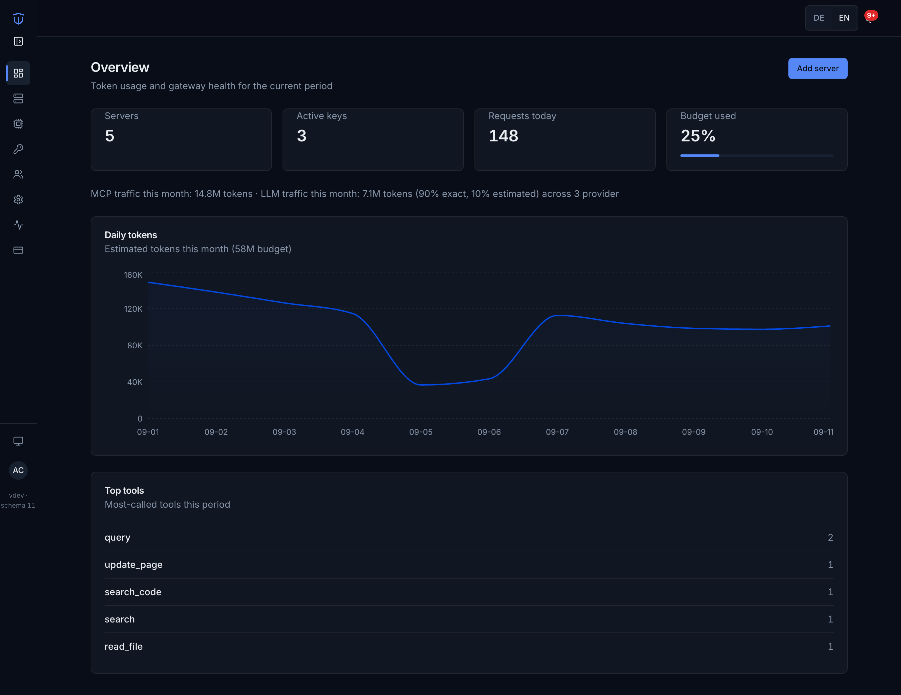
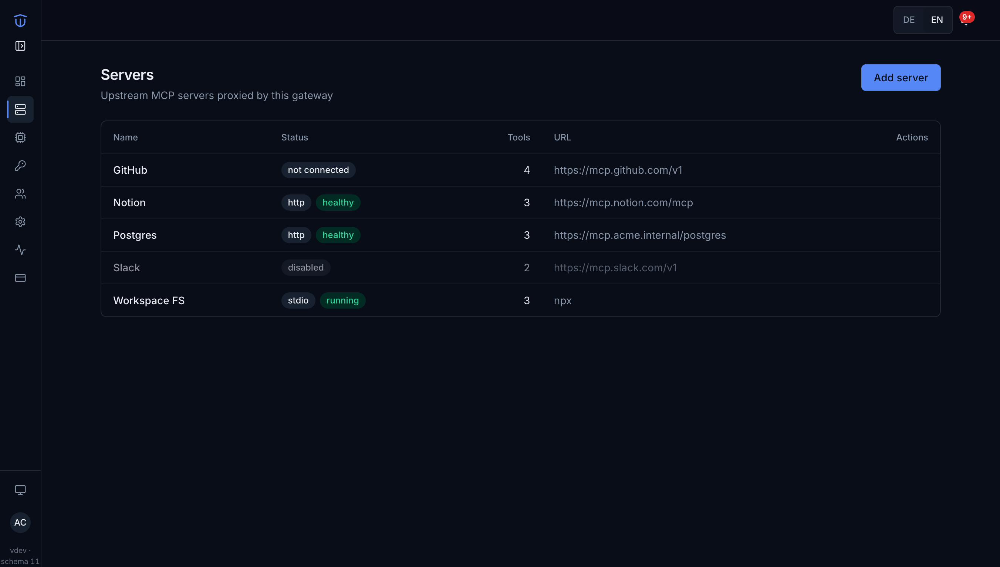
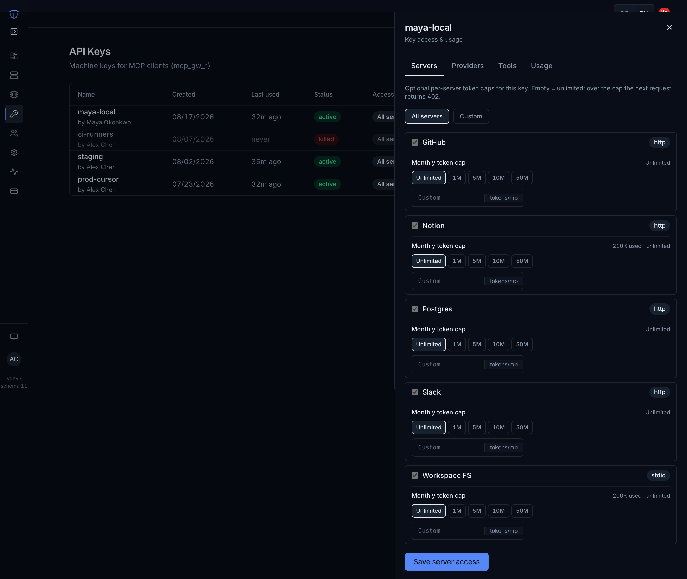
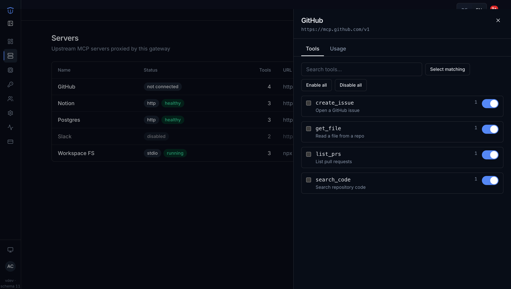
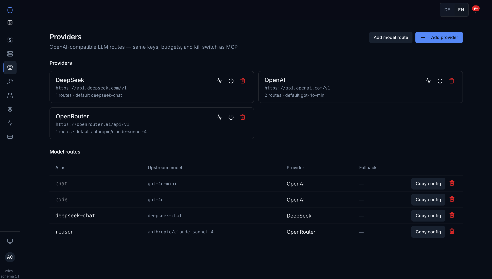
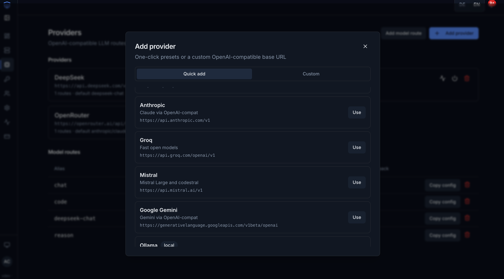
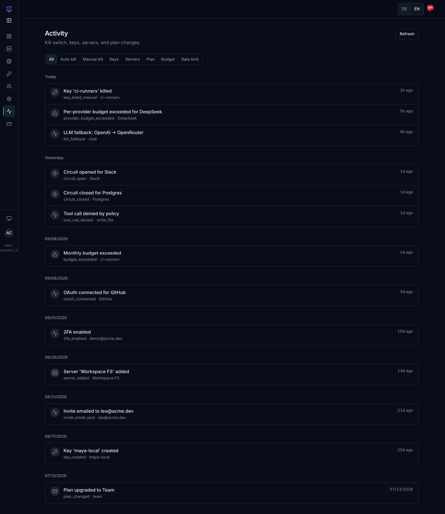
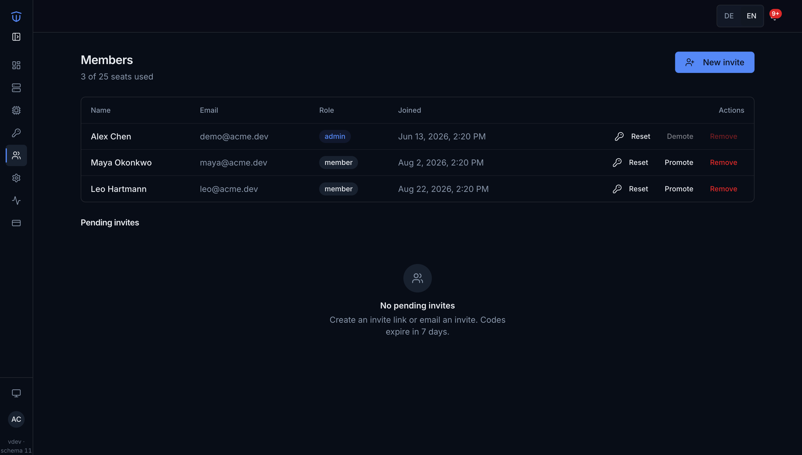
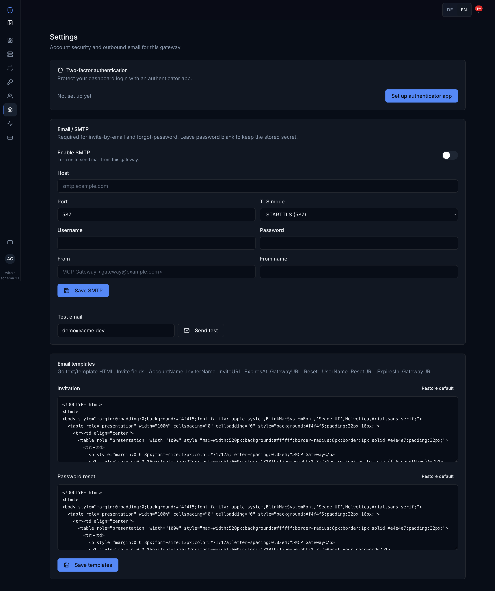

# TokenControlPlane

**Stop runaway agents.** One gateway in front of all your agent traffic — MCP tools **and** LLM models — one budget, one kill switch. Sits between AI clients (Cursor, Claude Desktop, Windsurf) and remote MCP servers / OpenAI-compatible model APIs; hard token budgets; a single static Go binary.

Source: [github.com/devthinker-ai/TokenControlPlane](https://github.com/devthinker-ai/TokenControlPlane)



*Dashboard overview: servers, active keys, requests today, budget used, daily tokens, and top tools — MCP and LLM traffic in one place.*

## 5-minute quickstart

```bash
docker run -p 8080:8080 -v mcp-data:/data ghcr.io/devthinker-ai/tokencontrolplane:latest
```


1. Open [http://localhost:8080](http://localhost:8080) → register
2. Add a remote MCP server (streamable-HTTP URL + API key, or **OAuth sign-in** for servers like Higgsfield — see [docs/UPSTREAM_AUTH.md](docs/UPSTREAM_AUTH.md)), **or a local (stdio) server** (`npx` / `uvx` / binary — see [docs/STDIO.md](docs/STDIO.md)). Browse tools and (Pro) control access — see [docs/TOOL_POLICY.md](docs/TOOL_POLICY.md).
3. Generate a gateway key (`tcp_*`)
4. Paste the Claude Desktop / Cursor snippet into your client config
5. Call a tool — usage shows up on the dashboard; kill the key anytime → clients get **402**

**Total: about five minutes, zero other tooling.**



*Add remote HTTP or local stdio MCP servers; health, tool counts, and protocol in one list.*



*Issue `tcp_*` keys, set per-server token caps, kill a runaway key → clients get **402** on the next request.*

Or build from source:

```bash
make build
./bin/tokencontrolplane -addr :8080
```

`make build-go` builds without npm if `pkg/web/dist` already exists.

## Updating

Migrations are **forward-only** (no down-migrations in v1). Before each unapplied migration the gateway writes `*.db.backup` via `VACUUM INTO` (one generation).

### Docker

```bash
docker compose pull && docker compose up -d
```

Migrations run on container start. Tag images as `ghcr.io/devthinker-ai/tokencontrolplane:<TAG>` **and** `:latest` on release (matches [github.com/devthinker-ai/TokenControlPlane](https://github.com/devthinker-ai/TokenControlPlane)). Pinning `:latest` is fine because migrations are forward-only and tested; pin a TAG when you need to stay put.

### Self-hosted binary

```bash
tokencontrolplane update --check          # exit 1 if newer
tokencontrolplane update                  # download, verify SHA256SUMS, replace binary
tokencontrolplane rollback                # restore tokencontrolplane.prev (one generation only)
```

Air-gapped:

```bash
tokencontrolplane update --file ./tokencontrolplane_linux_amd64_v1.0.0 --sha256 <hex>
# or place SHA256SUMS in the cwd and omit --sha256
```

Set `NO_UPDATE_CHECK=1` or `UPDATE_URL` for mirrors. Rollback refuses if the DB schema is newer than the binary’s embedded migrations — restore a DB backup in that case.

### Dashboard

`GET /api/v1/version` joins build metadata with the license update window. When a newer release exists and the window is active, the dashboard banner offers **Update now** (admin can run a verified server-side update). If the window expired, the banner points at renew — the version you own keeps working. Set `NO_UPDATE_CHECK=1` to disable outbound checks (air-gap). See [docs/RELEASING.md](docs/RELEASING.md).

## Stop runaway agents

| Code | Meaning |
|------|---------|
| **401** | Bad gateway key |
| **403** | Disabled key or server |
| **402** | Budget exhausted **or** kill switch (distinct JSON bodies) |
| **429** | Rate limit (`Retry-After`) |
| **503** | Upstream circuit open |

- **Kill switch:** kill a key from the dashboard or `/admin` → immediate 402 on the next request.
- **Local (stdio) MCP servers:** spawn `npx` / `uvx` / binaries; same client URL as remote — see [docs/STDIO.md](docs/STDIO.md).
- **One-time license, no subscription** — pay once, self-host, keep the version you own.
- **Team seats** — invite colleagues (no SMTP); named-team flat key ([docs/TEAM.md](docs/TEAM.md)).
- **LLM providers** — OpenAI-compatible chat completions through the same keys/budgets ([docs/LLM_ROUTING.md](docs/LLM_ROUTING.md)).
- **Auto-kill:** >120 requests / 60s per key (configurable via `LOOP_THRESHOLD`) → key auto-killed.
- **Budgets:** estimated tokens = bytes/4; enforced pre-flight (the oversized call completes; the next dies).



*Tool policy: enable or disable what agents may call without changing the upstream.*



*LLM providers and model routes — same keys and budgets as MCP traffic.*



*Quick-add presets (Anthropic, Groq, Mistral, Gemini, Ollama, …) or a custom OpenAI-compatible base URL.*



*Activity: kills, budget hits, circuit open/closed, tool denied by policy, OAuth, plan changes.*



*Team seats and roles — humans in the dashboard, not API consumers.*



*Settings: authenticator 2FA for dashboard users; optional SMTP for invites and password reset.*

## Self-hosted licensing

Offline RS256 license JWTs (`TOKENCONTROLPLANE_LICENSE_KEY`). Unlicensed installs get the free tier (**3 servers**, **3 seats**, **5M monthly tokens**). Invalid/expired keys **fail open** to free — a bad key never takes down an air-gapped gateway.

Self-hosted licensing is **offline and honor-based**; keys are bound to plan caps, not machines, in v1. No phone-home.

## Buy & install

**No subscription.** Pay once via [Lemon Squeezy](https://lemonsqueezy.com) (merchant of record — they handle VAT/sales tax/refunds). You keep the version you bought; renew only for the next version. After checkout the license key appears in your dashboard **License** page and in the LS order email.

```bash
TOKENCONTROLPLANE_LICENSE_KEY=*** tokencontrolplane
# or in docker-compose:
# environment:
#   TOKENCONTROLPLANE_LICENSE_KEY: "***"
```

Sign keys manually with `tokencontrolplane-license` (private key never in the repo):

```bash
tokencontrolplane-license --private-key ~/.secrets/license.pem --in claims.json
```

## Configuration

Everything is env vars (see `tokencontrolplane -h`):

| Variable | Purpose |
|----------|---------|
| `JWT_SECRET` | Dashboard session secret |
| `ADMIN_TOKEN` | `/admin/*` bearer token |
| `GATEWAY_URL` | Public URL for client snippets |
| `DISABLE_REGISTER` | `1` blocks new account signup (invite join still works) |
| `TOKENCONTROLPLANE_LICENSE_KEY` | Self-hosted license JWT |
| `TOKENCONTROLPLANE_LICENSE_PRIVATE` | RSA private key path (dashboard mint / reissue) |
| `TOKENCONTROLPLANE_FOUNDERS_LIMIT` | Founders offer cap (default 100; `0`=unlimited, `-1`=off) |
| `LQ_SECRET_KEY` | Lemon Squeezy API key |
| `LQ_WEBHOOK_SECRET` | Webhook HMAC secret |
| `LQ_STORE_ID` / `LQ_VARIANT_ID_PRO` / `LQ_VARIANT_ID_TEAM` | LS catalog IDs |
| `DB_PATH` | SQLite file (default `~/.tokencontrolplane/gateway.db`) |
| `UPDATE_URL` | Override GitHub releases API (mirrors / air-gap) |
| `NO_UPDATE_CHECK` | `1` disables outbound update checks |
| `GITHUB_REPO` | `owner/name` for releases (default `devthinker-ai/TokenControlPlane`) |

## Docker Compose

```bash
cp .env.example .env   # optional
docker compose up --build
```

SQLite persists under `./data`.

## Development

```bash
go test ./...
cd frontend && npm test && npm run build
```

CGO is off (`CGO_ENABLED=0`); SQLite is pure Go (`modernc.org/sqlite`).

## Licensing

**Two different things are licensed here:**

1. **The code — Apache-2.0** ([LICENSE](LICENSE)). Free to use, modify, and redistribute, including commercially. You must keep the license and copyright notices. There is no requirement to share changes back, no copyleft, and no fee.
2. **The license key — commercial license.** A one-time purchase (see [Buy & install](#buy--install)) that unlocks Pro/Team plan caps. The key is an offline RS256 JWT signed with the vendor's private key; it grants plan capabilities, not a copy of the code.

This is the standard **open-core** model: the source is fully open and auditable (self-hosters can verify exactly what runs), while revenue comes from plan-gated capabilities delivered via a signed key.

**What this means in practice:**

| You can… | Under Apache-2.0 |
|---|---|
| Run the gateway free (free tier, fail-open) | Yes |
| Buy a key for Pro/Team caps | Yes |
| Fork, modify, or redistribute the source, even commercially | Yes |
| Forge a license key | No — only the vendor's private key can sign one |

**Honor-based gating.** The license check is plain source code, so a determined fork can change which caps it enforces. That is permitted by Apache-2.0. Enforcement is honor-based, not cryptographic — like other open-core products (GitLab, Keycloak). No phone-home: an unlicensed or expired key fails open to the free tier and never takes a gateway down.

**Private key hygiene.** Only the *public* key is committed (`pkg/license/license_pub.pem`). The signing private key is kept out of the repo and injected at build/sign time via `TOKENCONTROLPLANE_LICENSE_PRIVATE` or `--private-key`.
